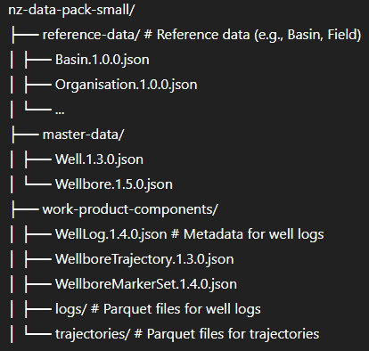

# Ingesting Wellbore related data into Azure Data Manager for Energy Data (ADME)

This codebase is made to help accelerate anyone who wants to ingest Wellbore and all the corresponding dependencies into ADME using a simple Jupyter notebook. Focus here is to ingest a curated and prepared New Zealand dataset that is ready for ingestion.

## Description

Add content here - The code in this notebook:

- Connects securely to your [Microsoft Azure Data Manager for Energy](https://learn.microsoft.com/en-us/azure/energy-data-services/) environment using Service Principal authentication
- Ingests the required **reference data** (Basin, Field, GeopoliticalEntity, Organisation, etc.)
- Loads **master data** such as Wells and Wellbores
- Registers metadata and uploads
  - **Well Logs**
  - **Wellbore Trajectories**
  - **Wellbore Marker Sets**
- Bulk data if any from the logs and trajectory folders

## Data is organized in the following way

## Prerequisites

  1. An active ADME instance with access to the following information, as these are required in configuration

     - TENANT_ID
     - APP_ID/CLIENT_ID
     - CLIENT_SECRET
     - ADME RESOURCE URL (e.g., <https://contoso.enery.azure.com>)

  2. Data set has to be prepped with correct entitlements (legal tags etc.)

     - DATA PARTITION ID and the LEGAL_TAG entries in your ADME instance **have** to match the entries from the prepped data set

## Access the notebook

- Notebook is available from here [adme-wellbore-ingestion](https://github.com/mkbinc007/admewellboredataingestion/main/src/adme-wellbore-ingestion-v2.ipynb)

## Make configuration changes to the notebook to reflect your environment

- TENANT_ID = "xxxxxxxx-xxxx-xxxx-xxxx-xxxxxxxxxxxx"
- CLIENT_ID = "xxxxxxxx-xxxx-xxxx-xxxx-xxxxxxxxxxxx"
- CLIENT_SECRET = "xxxxxxxxxxxxx"
- RESOURCE = "https://<your_instance>.energy.azure.com"
- PARTITION_ID = "xxxxxxxxx"
- LEGAL_TAG = "xxxxxxxxxx"
- DATA_ROOT = "/lakehouse/default/Files/nz-data-pack-small"

## Run the notebook code

- This example uses Azure Fabric environment to host and run the notebook
  